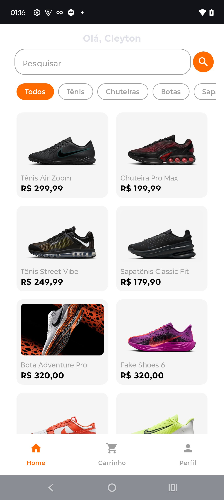
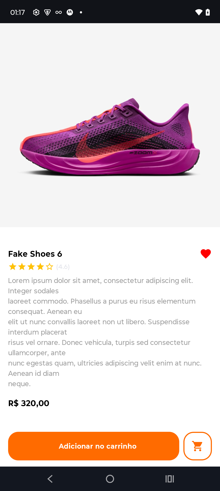

# Loja de Tênis - App Android com Jetpack Compose

Este é um aplicativo de loja de tênis desenvolvido com **Jetpack Compose**, utilizando a arquitetura **MVI (Model-View-Intent)**, **Clean Architecture**, **Koin**, e diversos princípios de **Clean Code** e **SOLID**. O projeto conta com **testes unitários**, **injeção de dependência**, **camadas bem definidas**, **componentização de UI** e **navegação com bottom bar**.

---

## ✨ Prints do App

| Tela Inicial                           | Tela de Detalhes                        |
|----------------------------------------|------------------------------------------|
|        |       |

---

## 📦 Tecnologias e Bibliotecas Utilizadas

- **Kotlin**
- **Jetpack Compose**
- **Compose Navigation**
- **Koin** para injeção de dependência
- **Coil** para carregamento de imagens via URL
- **Coroutines + Flow** para controle de estado e eventos
- **StateFlow / SharedFlow** para MVI
- **JUnit + Turbine** para testes unitários
- **Material 3** para design moderno

---

## 🧱 Arquitetura Utilizada

O projeto segue os princípios da **Clean Architecture** com separação em camadas:

---

## 🧠 Padrão MVI

O app foi totalmente implementado com o padrão **MVI**:

- **State:** representa o estado imutável da tela
- **Intent/Event:** ações do usuário
- **Effect (SharedFlow):** eventos de navegação e mensagens
- **ViewModel:** responsável por transformar os intents em novos states

---

## 🔁 Navegação

- Utiliza **Compose Navigation**
- Possui uma **Bottom Navigation Bar** com as rotas:
  - 🏠 Home
  - 🛒 Carrinho
  - 👤 Perfil

---

## ✅ Testes Unitários

### 📄 Casos de uso testados

- `GetAllProductsUseCaseTest`
- `GetProductsByCategoryUseCaseTest`
- `SearchProductsUseCaseTest`
- `GetProductByIdUseCaseTest`

---

## 📚 Princípios Aplicados

- **Clean Code**
- **SOLID**
- **Componentização**
- **Responsabilidade Única**
- **Inversão de dependência com Koin**
- **Reatividade com Flow e StateFlow**

---

## 🚀 Execução

Para rodar o projeto:

1. Clone este repositório
2. Abra no Android Studio (Arctic Fox+)
3. Execute em um emulador ou dispositivo real (API 24+)

---

## 🤝 Autor

Desenvolvido por Nathan Barros  
💼 Android Developer   

---

## 📝 Licença

Este projeto é de uso educacional e não possui fins comerciais.
